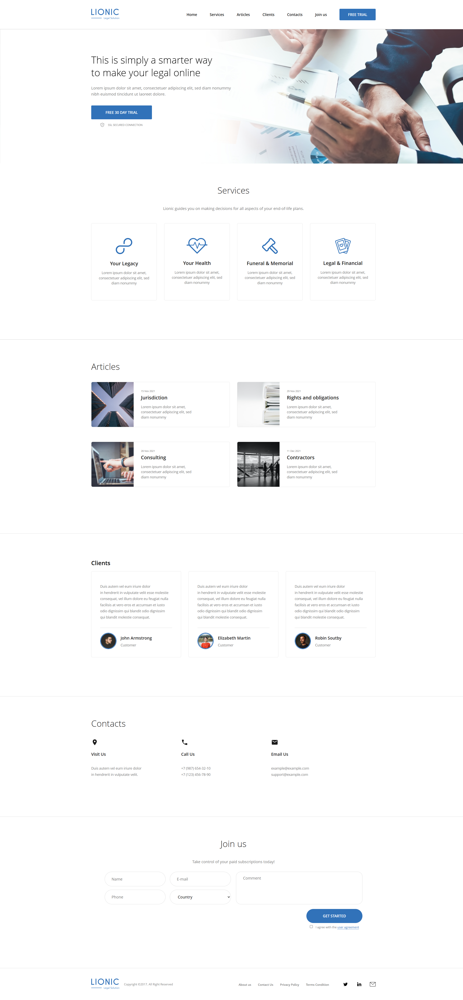

# Lionic - Legal Services Landing Page

## [View Live Demo](https://aesvle.github.io/Lionic-web/)

A modern, responsive landing page for a legal/consulting service, built from a Figma design. This project focuses on clean layout structure, responsive behavior, and pixel-accurate implementation.

## Key Features:

* **Figma to Code:** Translated a UI design into a functional webpage using HTML and CSS  
* **Responsive Layout:** Designed to adapt across mobile, tablet, and desktop using media queries  
* **Layout Techniques:** Built with Flexbox for structured and flexible sections  
* **Clean UI:** Simple, professional design with consistent spacing and typography  
* **Optimized Assets:** Used SVGs and optimized images for better performance  
